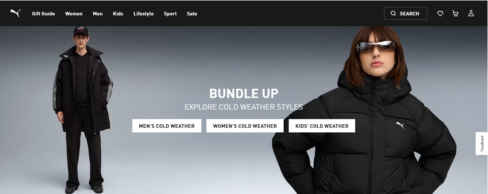
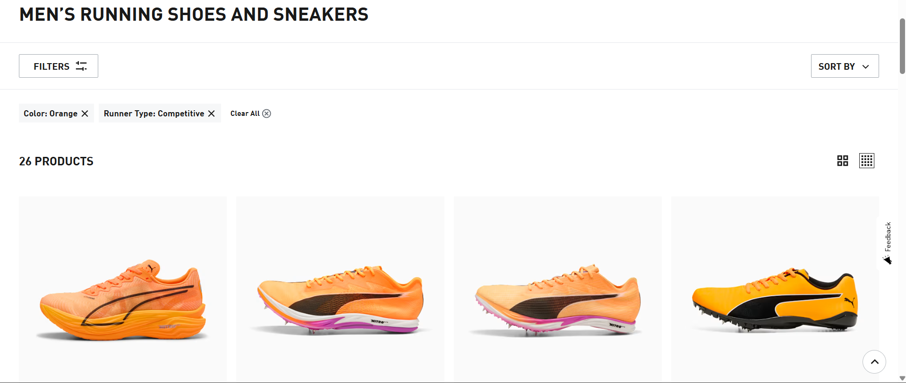
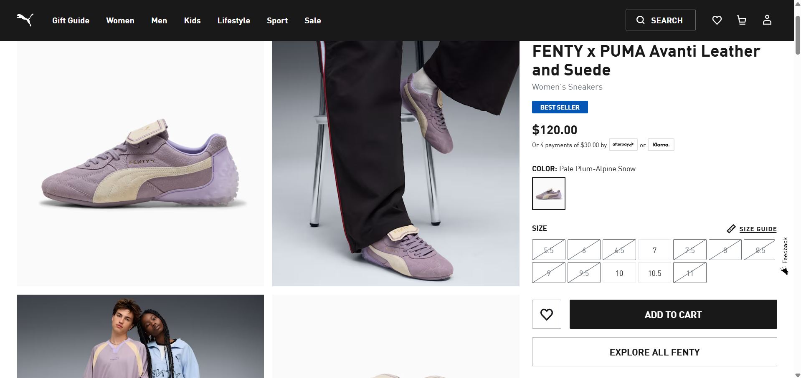
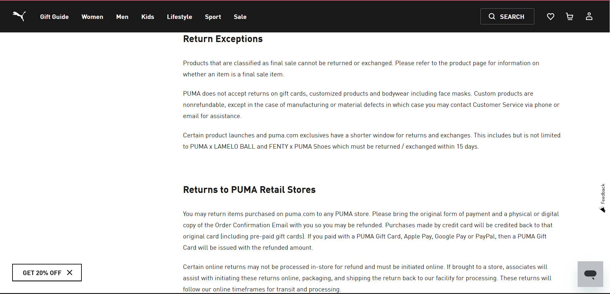

# Puma Competitor Analysis

## Archetype
Puma often uses the **Explorer** archetype, appealing to athletes and creative consumers who want performance and style. The brand also taps into the **Creator** archetype through collaborations with designers and artists (e.g., FENTY by Rihanna, A$AP Rocky).

## Persuasion Techniques
- **Social Proof**: Celebrity collaborations (Rihanna, A$AP Rocky, Neymar Jr.) highlight credibility.  
- **Scarcity & Urgency**: Limited-edition drops create FOMO.  
- **Authority**: Sponsorships in sports (track, soccer, basketball).  
- **Liking**: Relatable models and diverse campaigns.  
- **Reciprocity**: Discounts for students, seasonal promotions.  

## Sales Funnel Breakdown

### Stage 1 — Awareness
Puma’s homepage hero immediately grabs attention with seasonal promotions.

### Stage 2 — Interest
Category pages let shoppers filter by sport, color, and runner type, encouraging exploration.

### Stage 3 — Desire
Product detail pages for collaborations like FENTY x PUMA create exclusivity and urgency.  
The “Best Seller” tag and payment flexibility increase desire.

### Stage 4 — Action
Clear returns/exchanges policies reduce purchase hesitation and build trust at checkout.

## Strengths
- Strong collaborations (music, fashion, sports).  
- Wide global reach and brand recognition.  
- Balanced between performance and lifestyle.  

## Weaknesses
- Often positioned behind Nike and Adidas in market share.  
- Limited dominance in basketball and US sports compared to competitors.  

## Opportunities
- Expand digital campaigns for Gen Z and TikTok audiences.  
- Emphasize sustainability in products and marketing.  
- Strengthen presence in women’s sportswear.  
